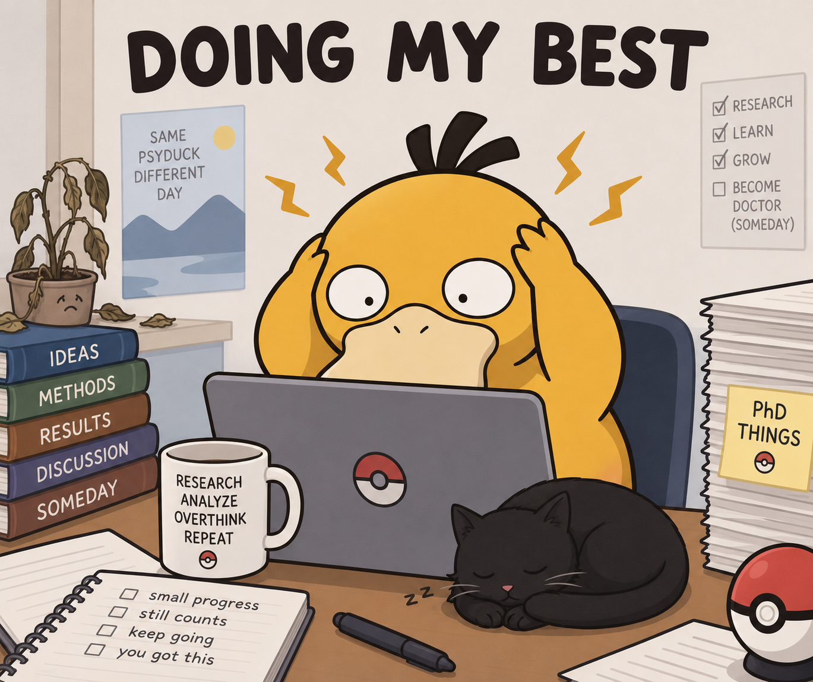

# Psyduck doing a PhD

This repo is a little home for a PhD in medical imaging: head-and-neck tumour segmentation on datasets like RADCURE and HECKTOR, with a lot of preprocessing, nnU-Net training, and coffee.

Doing my best — one experiment (and one headache) at a time.

