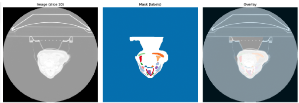
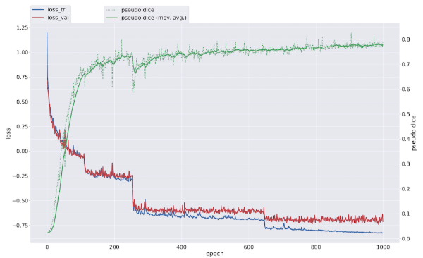
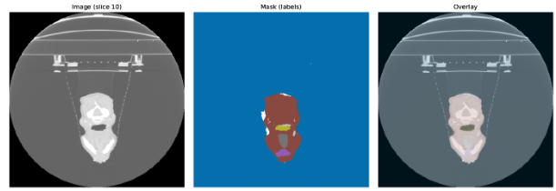
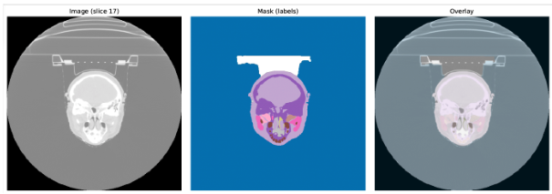
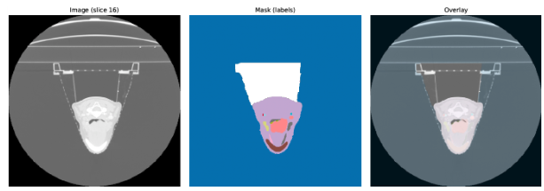
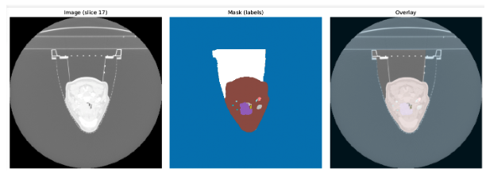

# TotalSegmentator Retrain on RADCURE366

**Author:** Xisca Pe  
**Date:** December 31, 2025

## Overview

This document describes the process of retraining TotalSegmentator on the RADCURE366 dataset, including dataset exploration, model training, evaluation, and benchmarking results.

---

## 1. Dataset Exploration

### Successful Cases

- **Total processed cases:** 366 successful cases
- **Case listing:** [View in Google Sheets](https://docs.google.com/spreadsheets/d/1v7A05o4blKSuZNb_jmMYvExBxY4BMwG8Xa4mMssmtB8/edit?gid=0#gid=0)

### Failed Cases

- **Total failed cases:** 61 cases
- **Failure breakdown:**
  - **44 cases (72%)** - Failed due to GTVp not existing in RTStruct
  - **12 cases** - Failed due to memory issues
  - **3 cases** - Failed due to DICOM folder structure issues
  - **2 cases** - Failed due to corner cases

### Organ Dictionary

- **Total organs:** 90 organs in the dictionary
- **Tumor ID:** 26 (GTVp)

### Example Cases

**RADCURE-0027:**


**RADCURE-0106:**


---

## 2. Dataset Split

The dataset was split into training, validation, and test sets with the following distribution:

- **Training:** 233 cases (63.7%)
- **Validation:** 59 cases (16.1%)
- **Test:** 74 cases (20.2%)

**Total:** 366/366 cases processed successfully

**Dataset folder name:** `Dataset366_TotalSegmentator`

---

## 3. Model Training

### Planning Phase

The first step in the training pipeline is dataset planning, which analyzes the dataset characteristics and generates appropriate preprocessing parameters.

#### Key Observations:

**Spacing and Shapes:**
- **Spacing:** 1×1×1 mm
- **Median shape:** 29×512×512 voxels
  - The patch voxel size of 29×512×512 indicates that the spacing between slices is smaller than the in-plane dimensions (y, z)
  - This preserves almost all z-context, which aligns with requirements for head & neck CT segmentation

**3D Full Resolution Configuration:**
- **Patch size:** 24×256×256 (less downsampling in z-direction)
- **Batch size:** 2 (may hit out-of-memory issues on some systems)
- **3D Low Resolution:** Dropped (not used)
- **CT Normalization:** Enabled (required for non-normalized input data)

### Training Progress

#### Initial Results (Epoch 94)

```
Epoch 94
Current learning rate: 0.00915
Train loss: -0.0443
Val loss: -0.0415
Pseudo Dice: 0.6128
Epoch time: 31.09 s
```

**Observations:**
- Pseudo-Dice of 0.62 is reasonable for epoch 94
- Individual organ Dice scores range from 0.5 to 0.9
- Some classes show 0.0 or NaN values, indicating:
  - Classes that appear very infrequently in the dataset
  - Potential need to exclude rare classes or apply class balancing
- Train and validation losses are close, indicating no overfitting

### Final Training Results

The model was trained for **1000 epochs**. The following chart shows the evolution of loss and Dice scores throughout training:



#### Loss Analysis:

- **Train vs Validation Loss:**
  - Both losses remained close throughout training, except for a slight divergence at the end
  - This indicates **no overfitting** occurred
  - Improvement occurred in steps, with the last significant improvement around epoch 620

**Interpretation:**
- Large organs were segmented accurately early in training
- Later epochs refined:
  - Boundary precision
  - Small structure detection
  - Class imbalance effects

#### Pseudo-Dice Evolution:

- Rapid improvement in the first 200 epochs
- Steady improvement throughout the remaining training
- **Best Pseudo-Dice achieved:** 0.780

#### Per-Organ Dice Scores:

Detailed per-organ evaluation results: [View in Google Sheets](https://docs.google.com/spreadsheets/d/142D1Tqtzfh2Yvyw1U2BP1vFWz8P_-13r4dh9Rdt1FXM/edit?gid=463981978#gid=463981978)

**Key findings:**
- **Large organs** (e.g., other tissues, head, maxillary) show high Dice scores (>0.9)
- **Rare organs** that appear infrequently show lower scores (<0.75)
- **GTVp (tumor) has the lowest score:** 0.6215

**GTVp challenges:**
- Usually small in size
- Irregular shape
- High variability across cases
- Often low contrast with surrounding tissue

**Potential improvements:**
- Tumor-focused fine-tuning as a second-stage model
- Class-specific loss weighting
- Data augmentation focused on tumor regions

---

## 4. Test Set Evaluation

### Overall Results

Test set evaluation results: [View in Google Sheets](https://docs.google.com/spreadsheets/d/142D1Tqtzfh2Yvyw1U2BP1vFWz8P_-13r4dh9Rdt1FXM/edit?gid=0#gid=0)

- **Average Dice across all structures:** 0.8284

### GTVp (Tumor) Specific Analysis

**GTVp Dice Statistics:**
- **Mean Dice:** 0.519
- **Median Dice:** 0.582

**Distribution by Quantile:**

| Quantile | Dice Score |
|----------|------------|
| 10%      | 0.051      |
| 25% (Q1) | 0.351      |
| 50% (Median) | 0.582   |
| 75% (Q3) | 0.718      |
| 90%      | 0.795      |

**Low-performing cases (Dice < 0.01):**
- RADCURE-0397 (0.000)
- RADCURE-0040 (0.000)
- RADCURE-0174 (0.0021)
- RADCURE-0507 (0.008)
- RADCURE-0275 (0.003)

**Possible reasons for low scores:**
- GTVp is very small
- Low contrast with surrounding tissue
- Tumor missed entirely by the model

**High-performing cases (Dice > 0.84):**
- RADCURE-0031 (0.86)
- RADCURE-0392 (0.85)
- RADCURE-0191 (0.84)

### Case Review

#### Low Dice Cases

**Case 1:**


- The shape of the structure is quite irregular
- The tumor changes shape inconsistently across CT slices

**Case 2:**


- Tumor located in the nasal area (away from typical neck region)
- Not clearly identifiable in the CT scan

#### High Dice Cases

**Case 1:**


- Large tumor area
- Clear boundaries

**Case 2:**


- Large, well-defined tumor region
- Good contrast with surrounding tissue

---

## 5. Benchmarking Comparison

When comparing our results with relevant publications on tumor segmentation:

### HECKTOR Challenge (PET/CT)
- **DSC on GTVp:** 0.75-0.77
- **Reference:** [HECKTOR Challenge Paper](https://www.sciencedirect.com/science/article/pii/S1361841523002323)

### nnU-Net Variants
- **DSC on GTVp:** 0.77
- **Reference:** [nnU-Net Paper](https://link.springer.com/chapter/10.1007/978-3-031-27420-6_4)

### Studies on GTVp Segmentation Alone
- **Reported range:** 0.60-0.70

**Our results:**
- **Median Dice:** 0.582 (below the 0.60 range start)
- **75th percentile:** 0.718 (above the 0.70 range end)
- **Bimodal distribution** suggests:
  - Some cases perform very well (>0.70)
  - Some cases struggle significantly (<0.40)

---

## 6. Conclusions

### Summary

Our results are below the benchmarking range but point in the right direction:

- **Median Dice (0.582)** is slightly below the 0.60-0.70 range reported in literature
- **75th percentile (0.718)** exceeds the upper bound of the reported range
- **Bimodal distribution** indicates:
  - Model performs well on cases with large, well-defined tumors
  - Model struggles with small, low-contrast, or irregularly shaped tumors

### Next Steps

Several potential improvements:

1. **Tumor-focused fine-tuning:**
   - Train a second-stage model specifically for GTVp segmentation
   - Use the current model as a preprocessor/initializer

2. **Image processing improvements:**
   - Enhanced contrast normalization
   - Tumor-specific data augmentation
   - Multi-scale training approaches

3. **Model architecture:**
   - Class-specific loss weighting
   - Focal loss for handling class imbalance
   - Attention mechanisms for small structures

4. **Data quality:**
   - Review and potentially exclude low-quality annotations
   - Increase training data for rare tumor types
   - Implement active learning for challenging cases

---

## References

- **Dataset:** RADCURE366
- **Model:** TotalSegmentator (retrained)
- **Framework:** nnU-Net v2
- **Configuration:** 3D Full Resolution
- **Training epochs:** 1000
- **Best Pseudo-Dice:** 0.780
